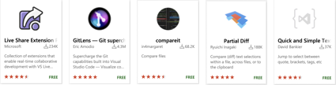

# Zowe and VS Code - A love history

<div align="center"></div>

## Introduction

Let's take a look on my preferred tool to work with z/OS. When we start talk to people about our daily on mainframe, much of them think about the old fashion way with black screen and green letters... But my preferred tool to work as a System Programmer is VS Code! Yup, the same code editor you are used to on any other developer environment i'm also using to centralize all my activities as a SysAdmin. And this is possible thanks to Zowe Explorer!

## Prerequisites

- NodeJS installed

This article will guide you in how get started with Zowe and VSCode and how to get the most of them for your daily activities.

## Estimated time

You should be able to finish this article in about 15 minutes.

## Steps

1. Getting Familiar with Zowe and VS Code
2. Mainframe Extensions
3. General Extensions
4. Trying it...
5. Fit it for you!
6. What are the possibilities if your environment doesn't have zOSMF
7. Where to try it?

### Getting Familiar with Zowe and VS Code


<div align="center"></div>

Zowe is a project within Open Mainframe Project, the first open source project for z/OS and it aims to connect System Administrative and developer tools, making the mainframe a more agile environment.

Reduce the learning curve of the platform, allowing new professionals to start on it using the same tools they are used to have in any other platform.

With 3 components, Zowe CLI - a NodeJS application that will run on your machine, Zowe Application Framework - a virtual desktop that you access through your browser - and Zowe API Mediation Layer - a gateway to facilitate you manage your mainframe APIs.

<div align="center"></div>

What w are going to see here, the Zowe explorer is made on top of Zowe CLI - Do i need to say that i love the CLI?🤓

For you to start with it you don't need to have Zowe installed on your LPAR, if you have zOSMF already running, you can install the CLI on your personal machine and make use of it!

How to Install the CLI?

As it is a Node JS application, you need do have Node JS installed, i will let this link for you to how to install it. Inside of NodeJS we have NPM, a package manager that we are going to use to install the CLI.
Open a terminal and type the following command(this is the simplest way but i believe will work only for mac and linux — you can still follow the complete instructions from Zowe Docs):
```
sudo npm install -g @zowe/cli@zowe-v1-lts --loglevel=error
```

VS Code…

<div align="center"></div>

Launched on 2015, it is a text editor created by Microsoft, and in 3 years became the most popular editor according to StackOverflow. VS Code is also Open Source, and it is very customizable, with a lot of plugins for you to use, some dedicated to mainframe some nothing.

VS Code is available for Mac, Linux and Windows, through the link `https://code.visualstudio.com/#alt-downloads`
Once you install VS Code it doesn't come looking like the picture above, You need to go to Marketplace and install what you want. So I will let some plugins suggestion here, that i think will help you a lot!

### Mainframe Extensions

<div align="center"></div>

- Zowe Explorer - This extension will let us interact with datasets, uss files and jobs from our LPARs.

- IBM Z Open Editor - This brings a series of features to work with Cobol, PL/I and JCL

- Workflows4z - If you work with zOSMF workflows, this will help you a lot to create and validate them.

- ibm-assembler - Working with Assembler? This brings to you highlight, autocompletion…

If you search for mainframe or Zowe, much more has already been developed by the community.

### General Extensions

Not only mainframe extension, you can take advantage of all other available extensions

<div align="center"></div>

- Live Share Extension - Imagine you are working with a remote team, this extension allows you to work together with someone else on your VS Code.
- GitLens - Working with git? A lot of useful tools integrated to work on your project
- Compareit and Partial Diff - Are you used to work with SuperCompare? so you have here on Compareit an option to see the differences between two files, or with Partial Diff compare the difference between text selections.
- Quick and Simple Text selection — Helps you to select text between quotes, brackets, etc…

